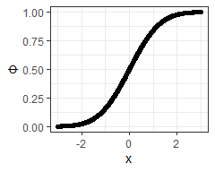

# About the HospitalStarRatings App


This app uses the R package
[hospitalstars](https://github.com/jimurick/hospitalstars)

The package is based on two CMS sources:

-   Measure score data was taken from the [Hospitals archived data
    snapshots](https://data.cms.gov/provider-data/archived-data/hospitals)
-   The Star rating algorithm was translated to R from the [SAS
    Package](https://qualitynet.cms.gov/inpatient/public-reporting/overall-ratings/sas)

## Tab 1: Map

## Tab 2: Plots

## Tab 3: About

Notes to give end-users motivation for the app and information about
data sources.

## Gratuitous Math

Standard normal CDF:

$$
\Phi(x)=\int\_{-\infty}^{x}\frac{dt}{\sqrt{2\pi e^{t^2}}}
$$

The R function `pnorm()` calculates *Φ*:

``` r
suppressPackageStartupMessages(library(tidyverse))
theme_set(theme_bw())

data.frame(x = seq(from = -3, to = 3, by = 0.01)) |>
  mutate(Φ = pnorm(x)) |>
  ggplot(aes(x, Φ)) + geom_point() + geom_line()
```


