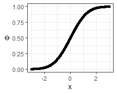

# About the HospitalStarRatings App


This app uses the R package
[hospitalstars](https://github.com/jimurick/hospitalstars)

The package is based on two CMS sources:

-   Measure score data was taken from the [Hospitals archived data
    snapshots](https://data.cms.gov/provider-data/archived-data/hospitals)
-   The Star rating algorithm was translated to R from the [SAS
    Package](https://qualitynet.cms.gov/inpatient/public-reporting/overall-ratings/sas)

## Tab 1: Map

I took the data in the package’s dataframe
`hospitalstars::hospital_info_df` and geocoded it with Google’s
[geocoding
API](https://developers.google.com/maps/documentation/geocoding/overview)
in python.

## Tab 2: Plots

CMS collects data from most larger hospitals to calculate

<table class="about-table" data-quarto-postprocess="true">
<thead>
<tr class="header">
<th style="text-align: left;" data-quarto-table-cell-role="th">ID</th>
<th style="text-align: left;"
data-quarto-table-cell-role="th">Metric</th>
</tr>
</thead>
<tbody>
<tr class="odd">
<td style="text-align: left;">MORT_30_AMI</td>
<td style="text-align: left;">Acute Myocardial Infarction (AMI) 30-Day
Mortality Rate</td>
</tr>
<tr class="even">
<td style="text-align: left;">H_COMP_2_STAR_RATING</td>
<td style="text-align: left;">Doctor communication</td>
</tr>
<tr class="odd">
<td style="text-align: left;">HAI_1</td>
<td style="text-align: left;">Central Line Associated Bloodstream
Infection (ICU + select Wards)</td>
</tr>
</tbody>
</table>

<br/>The metrics are divided into are 5 groups:

-   Mortality
-   Patient Experience
-   Process
-   Readmission
-   Safety

## Tab 3: About

Notes to give end-users motivation for the app and information about
data sources.

## Gratuitous Math

Standard normal CDF:

$$
\Phi(x)=\int\_{-\infty}^{x}\frac{dt}{\sqrt{2\pi e^{t^2}}}
$$

The R function `pnorm()` calculates *Φ*:

``` r
suppressPackageStartupMessages(library(tidyverse))
theme_set(theme_bw())

data.frame(x = seq(from = -3, to = 3, by = 0.01)) |>
  mutate(Φ = pnorm(x)) |>
  ggplot(aes(x, Φ)) + geom_point() + geom_line()
```


